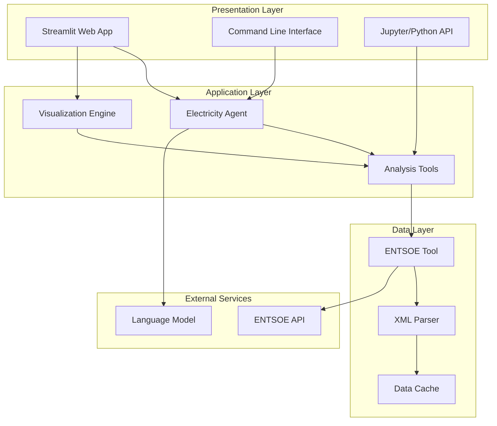
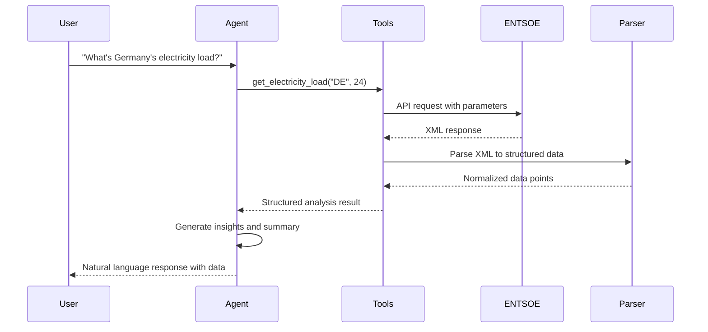

# Design Document

## Overview

The European Electricity Market Analysis Agent is a multi-layered system that provides intelligent access to European electricity market data through both conversational AI and programmatic interfaces. The system integrates with the ENTSOE Transparency Platform API to deliver real-time electricity market analysis across 17 European countries.

The architecture follows a modular design with clear separation of concerns:
- **Data Layer**: ENTSOE API integration and data processing
- **Agent Layer**: AI-powered conversational interface using Strands framework
- **Application Layer**: Web interface and programmatic access
- **Presentation Layer**: Interactive dashboards and visualization

## Architecture

### System Architecture Diagram



### Component Architecture

The system is organized into the following key components:

1. **ENTSOE Integration Layer** (`src/tools/entsoe_tool.py`)
   - Direct API communication with ENTSOE Transparency Platform
   - XML response parsing and data normalization
   - Country-specific configuration and error handling

2. **Agent Intelligence Layer** (`src/agents/electricity_agent.py`)
   - Strands-based conversational AI agent
   - High-level analysis tools and market insights
   - Multi-model support (Anthropic, Bedrock, OpenAI)

3. **Web Application Layer** (`streamlit_app.py`)
   - Interactive dashboard for non-technical users
   - Real-time data visualization with Plotly
   - Export capabilities and data exploration

4. **Configuration and Deployment** (`config/`, `run_*.py`)
   - Environment-based configuration management
   - Multiple deployment options (CLI, web, programmatic)

## Components and Interfaces

### ENTSOE Tool Component

**Purpose**: Provides direct access to ENTSOE Transparency Platform data with robust error handling and country-specific optimizations.

**Key Functions**:
- `get_electricity_load(country_code, hours_back)`: Retrieves consumption data
- `get_electricity_generation(country_code, hours_back)`: Retrieves production data
- `get_day_ahead_prices(country_code, days_back)`: Retrieves market prices
- `get_renewable_forecast(country_code, hours_ahead)`: Retrieves renewable predictions
- `get_cross_border_flows(from_country, to_country, hours_back)`: Retrieves interconnection flows

**Interface Contract**:
```python
{
    "status": "success" | "error",
    "data_points": [
        {
            "timestamp": "ISO8601 datetime",
            "value": float,
            "unit": "MW" | "EUR/MWh",
            "metadata": {...}
        }
    ],
    "total_points": int,
    "country_code": str,
    "time_range": {
        "start": "ISO8601 datetime",
        "end": "ISO8601 datetime",
        "data_delay_hours": int
    }
}
```

### Electricity Agent Component

**Purpose**: Provides intelligent, conversational access to electricity market data with contextual analysis and insights.

**Key Features**:
- Natural language query processing
- Multi-country comparative analysis
- Automated insight generation
- Chart code generation for visualization

**Agent Tools**:
- `get_country_electricity_overview()`: Comprehensive country analysis
- `compare_country_electricity()`: Multi-country comparison
- `analyze_cross_border_electricity_flows()`: Regional flow analysis
- `get_renewable_energy_forecast()`: Renewable energy predictions
- `generate_electricity_chart_code()`: Visualization code generation
- `get_electricity_market_insights()`: Market trend analysis

### Web Application Component

**Purpose**: Provides user-friendly web interface for electricity market analysis without requiring technical expertise.

**Key Features**:
- Country selection with flag indicators
- Analysis type selection (Load, Prices, Generation, Forecasts, Flows)
- Interactive time-series charts with Plotly
- Data export capabilities
- Real-time error handling and user feedback

**Interface Flow**:
1. User selects country and analysis type
2. System validates parameters and fetches data
3. Data is processed and visualized
4. Interactive charts are displayed with summary statistics
5. Raw data is available for export

## Data Models

### Core Data Structures

**ElectricityDataPoint**:
```python
{
    "timestamp": datetime,      # ISO8601 format with timezone
    "value": float,            # Numeric value (MW, EUR/MWh, etc.)
    "unit": str,               # Unit of measurement
    "position": int,           # Sequence position in time series
    "metadata": {              # Additional context
        "business_type": str,
        "object_aggregation": str,
        "in_domain": str,
        "out_domain": str,
        "generation_type": str  # For generation data
    }
}
```

**CountryConfiguration**:
```python
{
    "country_code": str,       # ISO 3166-1 alpha-2 code
    "area_code": str,          # ENTSOE area code
    "country_name": str,       # Full country name
    "data_delay_hours": int,   # Publication delay
    "supported_data_types": [  # Available data types
        "load", "generation", "prices", 
        "renewable_forecast", "cross_border"
    ],
    "price_config": {          # Price-specific configuration
        "delay": int,
        "param_type": str,     # "biddingZone" or "domain"
        "currency": str
    }
}
```

**AnalysisResult**:
```python
{
    "status": str,             # "success" or "error"
    "data_type": str,          # Type of analysis performed
    "country": str,            # Target country
    "time_range": {
        "start": datetime,
        "end": datetime,
        "requested_hours": int,
        "actual_points": int
    },
    "summary_statistics": {
        "average": float,
        "maximum": float,
        "minimum": float,
        "volatility": float
    },
    "data_points": [ElectricityDataPoint],
    "insights": [str],         # Generated insights
    "recommendations": [str]   # Actionable recommendations
}
```

### Data Flow Architecture



## Error Handling

### Error Classification and Response Strategy

**API-Level Errors**:
- **Authentication Errors (401)**: Clear token setup instructions
- **Rate Limiting (429)**: Exponential backoff with user notification
- **Data Unavailability (404)**: Alternative time range suggestions
- **Bad Request (400)**: Parameter validation with correction hints

**Data Processing Errors**:
- **XML Parsing Failures**: Detailed error logging with raw content sample
- **Timestamp Conversion Issues**: Timezone handling with fallback mechanisms
- **Missing Data Points**: Gap identification and interpolation options

**Application-Level Errors**:
- **Configuration Errors**: Environment setup validation and guidance
- **Model Initialization Failures**: Fallback model selection
- **Visualization Errors**: Graceful degradation to tabular data

### Error Response Format

```python
{
    "status": "error",
    "error_type": "api_error" | "data_error" | "config_error",
    "error_code": str,         # Specific error identifier
    "error_message": str,      # User-friendly description
    "technical_details": str,  # Detailed technical information
    "suggestions": [str],      # Actionable remediation steps
    "retry_after": int,        # Seconds to wait before retry (if applicable)
    "request_context": {       # Original request parameters
        "country_code": str,
        "time_range": {...},
        "data_type": str
    }
}
```

## Testing Strategy

### Unit Testing Approach

**ENTSOE Tool Testing** (`test_all_tools.py`):
- Individual function testing for each data type
- Country-specific parameter validation
- Error condition simulation and handling
- Data format consistency verification

**Agent Testing** (`test_agent.py`):
- Conversational interface validation
- Tool integration testing
- Response format consistency
- Error propagation testing

**Integration Testing**:
- End-to-end data flow validation
- Multi-country analysis testing
- Web interface functionality testing
- Performance and load testing

### Test Data Management

**Mock Data Strategy**:
- Sample XML responses for each data type
- Country-specific test scenarios
- Error response simulation
- Time zone and date handling edge cases

**Live API Testing**:
- Configurable test suite with real API calls
- Rate limit compliance testing
- Data quality validation
- Performance benchmarking

### Continuous Integration

**Automated Testing Pipeline**:
1. Unit tests for all components
2. Integration tests with mock data
3. Limited live API testing (rate-limited)
4. Code quality and security scanning
5. Documentation generation and validation

## Performance Considerations

### Caching Strategy

**Data Caching**:
- In-memory caching for frequently requested data
- Configurable TTL based on data type and publication schedules
- Cache invalidation on API errors or stale data detection

**Response Optimization**:
- Lazy loading for large datasets
- Pagination support for historical data requests
- Compression for data transfer and storage

### Scalability Design

**Horizontal Scaling**:
- Stateless agent design for load balancing
- Database-backed caching for multi-instance deployments
- API rate limiting and request queuing

**Resource Management**:
- Connection pooling for ENTSOE API requests
- Memory-efficient XML parsing for large responses
- Configurable timeout and retry policies

## Security Considerations

### API Security

**Authentication Management**:
- Secure storage of ENTSOE API tokens
- Environment-based configuration with validation
- Token rotation and expiration handling

**Data Privacy**:
- No storage of sensitive user data
- Audit logging for API requests
- Compliance with GDPR and data protection regulations

### Application Security

**Input Validation**:
- Country code validation against supported list
- Time range validation with reasonable limits
- SQL injection prevention in any database operations

**Error Information Disclosure**:
- Sanitized error messages for end users
- Detailed logging for administrators only
- No exposure of internal system details