# European Electricity Market Analysis Agent - Architecture

This document provides visual representations of the application architecture using Mermaid diagrams.

## System Architecture Overview

```mermaid
graph TB
    %% User Interface
    USER[👤 User] --> STREAMLIT[Streamlit Web App<br/>chat_app.py]
    
    %% Core Flow
    STREAMLIT --> AGENT[Electricity Agent<br/>electricity_agent.py]
    AGENT --> TOOLS[ENTSOE Tools<br/>entsoe_tool.py]
    TOOLS --> API[ENTSOE API<br/>web-api.tp.entsoe.eu]
    
    %% AI Processing
    AGENT --> AI[AI Models<br/>Bedrock Nova Pro<br/>Claude 3 Sonnet]
    
    %% Available Functions
    subgraph "Available ENTSOE Functions"
        LOAD[get_electricity_load ✅]
        GEN[get_electricity_generation ✅]
        PRICES[get_day_ahead_prices ✅]
        FORECAST[get_generation_forecast ✅]
        RENEWABLE[get_renewable_forecast ✅]
        CROSS[get_cross_border_flows ✅]
        COUNTRIES[get_supported_countries ✅]
    end
    
    TOOLS --> LOAD
    TOOLS --> GEN
    TOOLS --> PRICES
    TOOLS --> FORECAST
    TOOLS --> RENEWABLE
    TOOLS --> CROSS
    TOOLS --> COUNTRIES
    
    %% Return Path
    API --> TOOLS
    TOOLS --> AGENT
    AI --> AGENT
    AGENT --> STREAMLIT
    STREAMLIT --> USER
    
    %% Styling
    classDef user fill:#e3f2fd,stroke:#1565c0,stroke-width:3px
    classDef interface fill:#e1f5fe,stroke:#01579b,stroke-width:2px
    classDef agent fill:#f3e5f5,stroke:#4a148c,stroke-width:2px
    classDef tools fill:#e8f5e8,stroke:#1b5e20,stroke-width:2px
    classDef functions fill:#c8e6c9,stroke:#2e7d32,stroke-width:2px
    classDef external fill:#ffebee,stroke:#c62828,stroke-width:2px
    
    class USER user
    class STREAMLIT interface
    class AGENT,AI agent
    class TOOLS tools
    class LOAD,GEN,PRICES,FORECAST,RENEWABLE,CROSS,COUNTRIES functions
    class API external
```



## Data Flow Sequence


## ENTSOE Document Types & Functions

```mermaid
graph LR
    subgraph "ENTSOE Document Types"
        A65[A65 - Actual Total Load]
        A75[A75 - Actual Generation per Type]
        A44[A44 - Day-Ahead Prices]
        A71[A71 - Generation Forecast]
        A69[A69 - Wind & Solar Forecast]
        A11[A11 - Cross-Border Flows]
        A77[A77 - Unavailability of Generation Units]
    end
    
    subgraph "Application Functions"
        LOAD_FUNC[get_electricity_load<br/>✅ Excellent Availability]
        GEN_FUNC[get_electricity_generation<br/>✅ Good Availability]
        PRICE_FUNC[get_day_ahead_prices<br/>✅ Excellent Availability]
        FORECAST_FUNC[get_generation_forecast_day_ahead<br/>✅ Good Availability]
        RENEWABLE_FUNC[get_renewable_forecast<br/>✅ Good Availability]
        CROSS_FUNC[get_cross_border_flows<br/>✅ Fixed & Working]
        UNAVAIL_FUNC[get_unavailability_production_units<br/>⚠️ Very Limited Availability]
    end
    
    A65 --> LOAD_FUNC
    A75 --> GEN_FUNC
    A44 --> PRICE_FUNC
    A71 --> FORECAST_FUNC
    A69 --> RENEWABLE_FUNC
    A11 --> CROSS_FUNC
    A77 --> UNAVAIL_FUNC
    
    classDef excellent fill:#c8e6c9,stroke:#2e7d32,stroke-width:2px
    classDef good fill:#dcedc8,stroke:#689f38,stroke-width:2px
    classDef limited fill:#fff3e0,stroke:#f57c00,stroke-width:2px
    classDef doctype fill:#e8eaf6,stroke:#3f51b5,stroke-width:2px
    
    class LOAD_FUNC,PRICE_FUNC excellent
    class GEN_FUNC,FORECAST_FUNC,RENEWABLE_FUNC,CROSS_FUNC good
    class UNAVAIL_FUNC limited
    class A65,A75,A44,A71,A69,A11,A77 doctype
```



## Supported Countries & Coverage

```mermaid
graph TB
    subgraph "European Countries (17 Total)"
        subgraph "Western Europe"
            DE[Germany 🇩🇪<br/>Excellent Data]
            FR[France 🇫🇷<br/>Excellent Data]
            NL[Netherlands 🇳🇱<br/>Good Data]
            BE[Belgium 🇧🇪<br/>Good Data]
            CH[Switzerland 🇨🇭<br/>Good Data]
            AT[Austria 🇦🇹<br/>Good Data]
        end
        
        subgraph "Southern Europe"
            IT[Italy 🇮🇹<br/>Good Data]
            ES[Spain 🇪🇸<br/>Good Data]
            PT[Portugal 🇵🇹<br/>Limited Data]
        end
        
        subgraph "Nordic Countries"
            SE[Sweden 🇸🇪<br/>Good Data]
            NO[Norway 🇳🇴<br/>Good Data]
            DK[Denmark 🇩🇰<br/>Good Data]
            FI[Finland 🇫🇮<br/>Good Data]
        end
        
        subgraph "Eastern Europe"
            PL[Poland 🇵🇱<br/>Limited Data]
            CZ[Czech Republic 🇨🇿<br/>Limited Data]
        end
        
        subgraph "British Isles"
            GB[Great Britain 🇬🇧<br/>Good Data]
            IE[Ireland 🇮🇪<br/>Limited Data]
        end
    end
    
    subgraph "Major Interconnections (Cross-Border Flows)"
        DE --- FR
        DE --- NL
        DE --- AT
        DE --- CH
        FR --- IT
        FR --- ES
        ES --- PT
        SE --- NO
        SE --- DK
        NL --- BE
        GB --- FR
        GB --- IE
    end
    
    classDef excellent fill:#c8e6c9,stroke:#2e7d32,stroke-width:2px
    classDef good fill:#dcedc8,stroke:#689f38,stroke-width:2px
    classDef limited fill:#fff3e0,stroke:#f57c00,stroke-width:2px
    
    class DE,FR excellent
    class NL,BE,CH,AT,IT,ES,SE,NO,DK,FI,GB good
    class PT,PL,CZ,IE limited
```



## Error Handling & Recovery

```mermaid
flowchart TD
    START[API Request] --> CHECK{Check Response}
    
    CHECK -->|200 OK| PARSE[Parse XML Response]
    CHECK -->|400 Bad Request| RETRY[Try Alternative Parameters]
    CHECK -->|401 Unauthorized| TOKEN_ERROR[API Token Error]
    CHECK -->|404 Not Found| NO_DATA[No Data Available]
    CHECK -->|429 Rate Limited| WAIT[Wait and Retry]
    
    PARSE --> XML_OK{XML Valid?}
    XML_OK -->|Yes| SUCCESS[✅ Return Data]
    XML_OK -->|No| XML_ERROR[XML Parsing Error]
    
    RETRY --> PARAM2[Try Method 2]
    PARAM2 --> PARAM3[Try Method 3]
    PARAM3 --> PARAM4[Try Method 4]
    PARAM4 --> ALL_FAILED[All Methods Failed]
    
    TOKEN_ERROR --> ERROR_MSG[Return Error with Suggestions]
    NO_DATA --> ERROR_MSG
    XML_ERROR --> ERROR_MSG
    ALL_FAILED --> ERROR_MSG
    WAIT --> START
    
    ERROR_MSG --> SUGGEST[Provide Alternative Functions<br/>and Troubleshooting Tips]
    
    classDef success fill:#c8e6c9,stroke:#2e7d32,stroke-width:2px
    classDef error fill:#ffcdd2,stroke:#d32f2f,stroke-width:2px
    classDef retry fill:#fff3e0,stroke:#f57c00,stroke-width:2px
    classDef process fill:#e3f2fd,stroke:#1565c0,stroke-width:2px
    
    class SUCCESS success
    class TOKEN_ERROR,NO_DATA,XML_ERROR,ALL_FAILED,ERROR_MSG error
    class RETRY,PARAM2,PARAM3,PARAM4,WAIT retry
    class START,CHECK,PARSE,XML_OK,SUGGEST process
```



## Technology Stack

```mermaid
graph TB
    subgraph "Frontend Layer"
        STREAMLIT_UI[Streamlit Web Interface<br/>Rich visualizations & charts]
        CHAT_UI[Chat Interface<br/>Conversational AI interaction]
        CLI_UI[Command Line Interface<br/>Direct agent queries]
    end
    
    subgraph "AI Framework"
        STRANDS[Strands Agents Framework<br/>Tool orchestration & management]
        TOOLS_DEC[@tool Decorators<br/>Function registration]
    end
    
    subgraph "AI Models"
        BEDROCK_MODEL[AWS Bedrock Nova Pro<br/>Primary AI model]
        CLAUDE_MODEL[Anthropic Claude 3<br/>Alternative AI model]
    end
    
    subgraph "Data Processing"
        PANDAS[Pandas<br/>Data manipulation]
        NUMPY[NumPy<br/>Numerical operations]
        PLOTLY[Plotly<br/>Interactive charts]
        PYTZ[PyTZ<br/>Timezone handling]
    end
    
    subgraph "API & Networking"
        REQUESTS[Requests<br/>HTTP client]
        XML_PARSER[ElementTree<br/>XML parsing]
        ENTSOE_CLIENT[Custom ENTSOE Client<br/>API wrapper]
    end
    
    subgraph "Development & Testing"
        PYTEST[PyTest<br/>Testing framework]
        BLACK[Black<br/>Code formatting]
        FLAKE8[Flake8<br/>Code linting]
        UV[UV Package Manager<br/>Dependency management]
    end
    
    STREAMLIT_UI --> STRANDS
    CHAT_UI --> STRANDS
    CLI_UI --> STRANDS
    
    STRANDS --> TOOLS_DEC
    STRANDS --> BEDROCK_MODEL
    STRANDS --> CLAUDE_MODEL
    
    TOOLS_DEC --> PANDAS
    TOOLS_DEC --> REQUESTS
    TOOLS_DEC --> XML_PARSER
    
    REQUESTS --> ENTSOE_CLIENT
    XML_PARSER --> ENTSOE_CLIENT
    
    PANDAS --> PLOTLY
    PANDAS --> PYTZ
    
    classDef frontend fill:#e1f5fe,stroke:#01579b,stroke-width:2px
    classDef ai fill:#f3e5f5,stroke:#4a148c,stroke-width:2px
    classDef data fill:#e8f5e8,stroke:#1b5e20,stroke-width:2px
    classDef api fill:#fff3e0,stroke:#e65100,stroke-width:2px
    classDef dev fill:#fce4ec,stroke:#880e4f,stroke-width:2px
    
    class STREAMLIT_UI,CHAT_UI,CLI_UI frontend
    class STRANDS,TOOLS_DEC,BEDROCK_MODEL,CLAUDE_MODEL ai
    class PANDAS,NUMPY,PLOTLY,PYTZ data
    class REQUESTS,XML_PARSER,ENTSOE_CLIENT api
    class PYTEST,BLACK,FLAKE8,UV dev
```

## Recent Improvements Summary


---

*This architecture documentation provides a comprehensive overview of the European Electricity Market Analysis Agent system, including all components, data flows, and recent improvements.*